# ILSpy: Diagnosis, Diagnostics, Treatment, And Discharge Flow In Project Hospital

Assembly studied: `C:\Program Files (x86)\Steam\steamapps\common\Project Hospital\ProjectHospital_Data\Managed\Assembly-CSharp.dll`

Decompile snapshot used for this pass:
- `tmp/assembly-csharp-decompile/Lopital/BehaviorPatient.cs`
- `tmp/assembly-csharp-decompile/Lopital/MedicalCondition.cs`
- `tmp/assembly-csharp-decompile/Lopital/ProcedureComponent.cs`
- `tmp/assembly-csharp-decompile/Lopital/HospitalizationComponent.cs`
- `tmp/assembly-csharp-decompile/Lopital/BehaviorDoctor.cs`
- `tmp/assembly-csharp-decompile/Lopital/ProcedureScriptExaminationDoctorsInterview.cs`
- `tmp/assembly-csharp-decompile/Lopital/ProcedureScriptExaminationReceptionFast.cs`
- `tmp/assembly-csharp-decompile/GameDBDepartment.cs`
- `tmp/assembly-csharp-decompile/GameDBMedicalCondition.cs`

## 1. Where the diagnosis is actually generated

The real disease is generated before any medical gameplay happens.

Primary chain:

1. `BehaviorPatient.RandomizeMedicalCondition(PatientMobility allowedMobility)`
2. `BehaviorPatient.TryToCreateMedicalCondition(...)`
3. `MedicalCondition.CreateMedicalCondition(GameDBMedicalCondition, BehaviorPatient, PatientMobility, ...)`

Key points:

- `TryToCreateMedicalCondition` first picks a department that can generate cases for the requested mobility.
- The selected department uses one of four randomizers from `GameDBDepartment`:
  - `DiagnosisRandomizerClinic`
  - `DiagnosisRandomizerMobile`
  - `DiagnosisRandomizerImmobile`
  - `DiagnosisRandomizerHelicopter`
- The chosen `GameDBMedicalCondition` is then materialized into a runtime `MedicalCondition`.

What `MedicalCondition.CreateMedicalCondition(...)` does:

- stores the true diagnosis in `m_gameDBMedicalCondition`
- randomizes disease age (`m_ageDays`)
- instantiates symptoms from `GameDBMedicalCondition.Symptoms`
- forces at least one symptom that the patient can complain about, otherwise generation is rejected
- rejects invalid combinations, for example:
  - patient would instantly die
  - mobile patient gets immobile-only symptom set
  - immobile patient gets no immobile symptom

Important consequence:

- the game does **not** generate the diagnosis at the moment of doctor confirmation
- the true disease already exists
- later diagnosis is only the process of narrowing `possibleDiagnoses` until one of them is accepted

## 2. What data drives diagnosis

Static DB structure:

- `GameDBMedicalCondition`
  - `Symptoms`
  - `Examinations`
  - `Treatments`
  - `DepartmentRef`
- each symptom has:
  - visibility state (`hidden` vs visible) at runtime
  - treatment links
  - examination links
  - hazard / collapse / death timing metadata

Runtime structure:

- `MedicalCondition.m_symptoms` is the real symptom list for this patient
- `MedicalCondition.m_possibleDiagnoses` is the current differential diagnosis list
- `MedicalCondition.m_diagnosedMedicalCondition` is the currently accepted diagnosis, which may still be wrong

`MedicalCondition.UpdatePossibleDiagnoses(...)` rebuilds the differential list from visible evidence.

`MedicalCondition.GetPossibleDiagnoses(...)` filters diagnoses by:

- visible symptoms
- hidden symptoms not yet discovered
- removed wrong diagnoses
- special-exam eliminations
- gender restrictions

Special shortcut:

- if the main symptom of a diagnosis becomes visible, that diagnosis is given probability `100`
- if only one diagnosis remains, the case is effectively clear

## 3. How diagnostics uncover evidence

### 3.1 Reception

Fast reception path:

1. `ProcedureScriptExaminationReceptionFast.UpdateStatePatientTalking()`
2. `ResolveComplainedAboutHazardousSymptoms()`
3. patient gets `EXM_INTERVIEW` scheduled
4. `MedicalCondition.UpdatePossibleDiagnoses(...)`

Reception only reveals hazardous complained-about symptoms and seeds the full doctor interview.

### 3.2 Doctor interview

Interview path:

1. `ProcedureScriptExaminationDoctorsInterview.UpdateStatePatientTalking()`
2. `TryToResolveASymptom()`
3. `MedicalCondition.UpdatePossibleDiagnoses(...)`
4. `MedicalCondition.IsClear(skillLevel, thresholdOfCertainty)`

This is the soft diagnostic pass:

- it reveals symptoms that the patient knows and complains about
- it recalculates the differential
- it checks whether the doctor now feels certain enough

### 3.3 Equipment / lab examinations

Candidate examination list is built by:

1. `ProcedureComponent.GetAllExaminationsForMedicalCondition(...)`
2. `ProcedureComponent.UpdateAllExaminationsForMedicalCondition(...)`
3. `ProcedureComponent.SelectExaminationForMedicalCondition(...)`
4. `BehaviorPatient.TryToScheduleExamination(...)`

The examination pool comes from:

- `possibleDiagnoses[*].Examinations`
- fallback `EXM_INTERVIEW` if not diagnosed yet
- surgery-complication examinations when relevant

When an examination finishes:

1. `ProcedureComponent.Update(...)`
2. `BehaviorPatient.UncoverSymptomsFromLastExamination(...)`
3. `MedicalCondition.UpdatePossibleDiagnoses(...)`

For lab flow:

1. `ProcedureComponent.FinishLabProceduresWithResultsReady()`
2. lab procedure is finished
3. `MedicalCondition.UpdatePossibleDiagnoses(...)`
4. a finished examination record is appended

Core mechanic:

- examinations do not directly "roll a diagnosis"
- they uncover hidden symptoms
- uncovered symptoms recalculate the differential

## 4. When the game commits to a diagnosis

Outpatient and inpatient AI both eventually call `BehaviorPatient.Diagnose(...)`.

Chain:

1. `BehaviorPatient.Diagnose(int thresholdOfCertainty, bool planCriticalTreatmentsAndPreemptiveExaminations)`
2. `MedicalCondition.Diagnose(DiagnosticApproach, float thresholdOfCertainty, Entity patient, bool forceCorrect = false)`

Decision inputs:

- current `possibleDiagnoses`
- whether the case is already clear
- doctor's `m_nextDiagnosticApproach`
- department certainty threshold

Doctor behavior is configured by:

- `BehaviorDoctor.SelectNextDiagnosticApproach(float certainty)`

Possible diagnostic approaches:

- `WAIT_TO_BE_CERTAIN`
- `RANDOM`
- `AMBIGUOUS`

Behavior:

- if the case is clear, diagnosis becomes the true `m_gameDBMedicalCondition`
- otherwise the doctor may:
  - wait
  - guess the most probable diagnosis
  - pick a random diagnosis
  - leave the case ambiguous

Important edge case:

- outpatient AI can switch to `BlockedByComplicatedDiagnosis` when there are still hidden symptoms, enough finished exams, several possible diagnoses remain, and the doctor's next approach is `AMBIGUOUS`

## 5. How hospitalization enters the route

Hospitalization can happen before final diagnosis.

Main outpatient hospitalization entry points:

- `BehaviorPatient.ObservationCheck(...)`
- hospitalization treatments discovered by `ProcedureComponent.PlanAllTreatments(...)`

`ObservationCheck(...)` triggers from emergency when:

- hazard is high, or
- `MedicalCondition.AnySymptomNeedsHospitalization()` is true, or
- diagnosis logic explicitly forces observation

Then:

1. a hospitalization treatment is planned
2. `BehaviorPatient.RequestHospitalization(...)` stores requested treatment and room type
3. `BehaviorPatient.CheckHospitalization()` searches for a free bed
4. if a bed is found:
   - procedure queue is adjusted
   - patient switches to `PatientState.OverriddenByHospitalization`
   - `HospitalizationComponent.SetHospitalized(...)` starts inpatient control

Important consequence:

- hospitalization is not only "after diagnosis"
- it can be used as a safety container while the case is still unresolved

## 6. Inpatient diagnosis and diagnostics route

Main inpatient loop:

1. `HospitalizationComponent.UpdateStateInBed(float deltaTime)`
2. periodically `HospitalizationComponent.SelectNextStep(float deltaTime)`

`SelectNextStep(...)` does, in order:

1. revalidate / reserve doctor
2. `TryToDiagnose()`
3. if hazard is high, pre-plan critical treatments
4. start planned treatments
5. if still undiagnosed and no planned exams:
   - `BehaviorPatient.TryToScheduleExamination(automaticallyChangeDepartment: false)`
6. start planned examinations
7. plan preemptive examinations
8. if outside room, send back to room

Important nuance:

- inpatient AI continues to use `BehaviorPatient.Diagnose(...)`
- hospitalization does not replace diagnosis logic
- it only wraps it in another state machine with transport, bed, monitoring, and release rules

## 7. How treatment is selected

Main chain:

1. `ProcedureComponent.GetAllTreatmentsForMedicalCondition(...)`
2. `ProcedureComponent.PlanAllTreatments(...)`
3. `BehaviorPatient.TryToScheduleTreatments(...)`
4. outpatient: `BehaviorPatient.TryToStartScheduledTreatment(...)`
5. inpatient: `HospitalizationComponent.TryToStartScheduledTreatment(...)`

Treatment pool construction:

- if there is a confirmed diagnosis, the game walks `GameDBMedicalCondition.Treatments`
- it matches them against visible runtime symptoms
- it also ensures main-symptom treatment is represented
- in `ALL_SYMPTOMS` mode it adds treatments for all visible active symptoms
- hospitalization treatments are injected by `GetHospitalizations(...)`

Critical nuance:

- treatment selection is symptom-driven, not just diagnosis-label-driven
- the diagnosis mainly constrains sequence and department ownership

## 8. What starting treatment actually changes

When a planned treatment is accepted:

1. `ProcedureComponent.SwitchToNextTreatment(index)`
2. `ProcedureComponent.SuppressSymptoms(GameDBTreatment)`

`SuppressSymptoms(...)` marks matching symptoms as inactive immediately.

That means:

- starting treatment already changes symptom activity
- completion mainly moves treatment from active to finished state and may add complications

Procedure completion:

- `ProcedureComponent.Update(...)`
- finished treatment moves from active to finished list
- surgery may add complications with `MedicalCondition.AddSurgeryComplications(...)`

Hospitalization-specific nuance:

- if the selected planned treatment is hospitalization, `SwitchToNextTreatment(...)` does not start a procedure script
- it sets prescribed hospitalization timers and makes sure a hospitalization request exists

## 9. What counts as "treated"

There are two different notions:

### 9.1 `HasBeenTreated()`

`MedicalCondition.HasBeenTreated(ProcedureQueue)` returns true when:

- there is a diagnosed condition, and
- the main symptom's treatment exists in active or finished treatments

This is a looser check.

### 9.2 `HasBeenCorrectlyTreated()`

`MedicalCondition.HasBeenCorrectlyTreated()` returns true when:

- there is a diagnosed condition, and
- the main symptom is no longer active

This is stricter.

Important consequence:

- outpatient release and inpatient release do not use exactly the same criterion

## 10. Outpatient exit route

Outpatient endgame lives in `BehaviorPatient.SelectNextProcedure()`.

AI outpatient branch:

- if diagnosed and no planned examinations remain:
  - if no planned treatments remain:
    - if `HasBeenCorrectlyTreated()` -> `Leave()`
    - else -> `TryToScheduleTreatments(...)`
  - else -> start planned treatment
- if still not diagnosed and hospitalization is not needed:
  - schedule another examination

So outpatient release is:

1. diagnosis accepted
2. no more diagnostic work pending
3. no more treatment pending
4. `HasBeenCorrectlyTreated()` is true
5. `BehaviorPatient.Leave()`

## 11. Inpatient release route

### 11.1 Observation release

Observation branch:

1. `HospitalizationComponent.UpdateStateInBed(...)`
2. `IsObservationOver()`
3. `ReleaseFromObservation()`

Observation can end when:

- minimum observation time passed
- current hospitalization is `TRT_HOSPITALIZATION_OBSERVATION`
- no reserved procedure
- no surgery happened
- nothing is planned
- hazard is low, or medium without hospitalization-needing symptoms

Then:

- if the patient has already been treated:
  - AI inpatient -> `SendHome()`
- otherwise:
  - patient is transferred back to clinic workflow for more diagnostics / treatment

### 11.2 Regular inpatient release

Main inpatient discharge gate:

`HospitalizationComponent.IsHospitalizationOver()`

Conditions:

- `HasBeenTreated(...)`
- worst known hazard is not `High`
- prescribed hospitalization time is over
- patient is not outside the room
- nothing is planned
- releasing window is open
  - trauma is allowed to bypass the normal release-time window

If all conditions pass:

- ICU:
  - hospitalization is reset
  - patient is re-evaluated for lower placement
- non-ICU AI:
  - `SendHome()`
  - `StopMonitoring()`
  - state becomes `Leaving`
- non-ICU player-controlled:
  - state becomes `WaitingToBeReleased`

## 12. Final discharge implementation

For hospitalized patients the real release is:

1. `HospitalizationComponent.SendHome()`
2. `ResetHospitalization()`
3. statistics, payment, mood, notifications
4. `ClearBed()`
5. `BehaviorPatient.Leave(pay: false, leaveAfterHours: false, leavingHospitalizationPatient: true)`

So the final exit is still `BehaviorPatient.Leave(...)`, but hospitalization wraps it with:

- hospitalization stats
- separate insurance payment path
- bed cleanup
- monitoring stop
- visitor cleanup

## 13. High-level route summary

```mermaid
flowchart LR
  A["BehaviorPatient.RandomizeMedicalCondition"] --> B["TryToCreateMedicalCondition"]
  B --> C["MedicalCondition.CreateMedicalCondition"]
  C --> D["Hidden/visible symptom state initialized"]
  D --> E["Reception / Interview / Examinations uncover symptoms"]
  E --> F["MedicalCondition.UpdatePossibleDiagnoses"]
  F --> G["BehaviorPatient.Diagnose -> MedicalCondition.Diagnose"]
  G --> H{"Diagnosis accepted?"}
  H -->|no| E
  H -->|yes| I["ProcedureComponent.PlanAllTreatments"]
  I --> J{"Needs hospitalization?"}
  J -->|yes| K["RequestHospitalization / CheckHospitalization"]
  K --> L["HospitalizationComponent.SelectNextStep"]
  L --> M["Inpatient exams / treatments / monitoring"]
  J -->|no| N["Outpatient treatment"]
  M --> O{"IsHospitalizationOver / ReleaseFromObservation?"}
  O -->|yes| P["HospitalizationComponent.SendHome"]
  N --> Q{"HasBeenCorrectlyTreated?"}
  Q -->|yes| R["BehaviorPatient.Leave"]
  P --> R
```

## 14. Main findings

1. The true disease is generated at patient creation, not at the moment of diagnosis confirmation.
2. Diagnostics work by uncovering hidden symptoms, not by directly assigning a disease.
3. `possibleDiagnoses` is recalculated repeatedly from currently visible evidence.
4. Hospitalization can start before final diagnosis.
5. Treatment planning is symptom-driven and may insert hospitalization as a prerequisite.
6. Outpatient release is stricter in practice: it wants `HasBeenCorrectlyTreated()`.
7. Inpatient release is broader: it wants `HasBeenTreated()` plus hazard, time, and queue checks.
