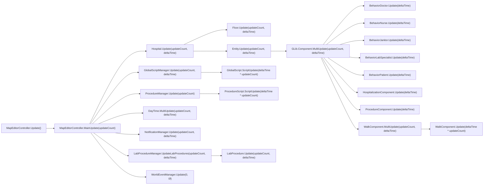

# Performance research #1: Update Loop Map

This pass maps the runtime tick chain for Project Hospital using `docs/performance-investigation.md`, `src/*.cs`, and the decompiled `Assembly-CSharp.dll`.

The key result is simple: there is one root simulation pump, and almost everything interesting hangs off it.

## Main update loop

## Frequency map

| Method | Frequency | State mutation | Safe to cache | Safe to profile |
| --- | --- | --- | --- | --- |
| `MapEditorController.MainUpdate(int)` | Per frame while gameplay is live; pauses or switches to 0-tick UI/build branches | Dispatches the whole sim tick, time, scripts, notifications, and sound state | No | Yes, but keep it shallow |
| `Hospital.Update(int, float)` | Once per sim tick | Updates departments, floors, characters, statistics, and post-update cleanup | No | Yes |
| `GLib.Entity.Update(int, float)` | Once per entity per sim tick | Fans out to every component via `MultiUpdate` | No | Yes, but do not deepen into state-machine internals |
| `BehaviorDoctor.Update(float)` | Once per doctor per entity tick | State machine, reservations, shifts, procedures, movement, UI-facing state | No | No deep profile |
| `BehaviorNurse.Update(float)` | Once per nurse per entity tick | State machine, reservations, stretcher handling, procedures, movement | No | No deep profile |
| `BehaviorJanitor.Update(float)` | Once per janitor per entity tick | State machine, room/tile selection, cart handling, cleaning, movement | No | No deep profile |
| `BehaviorLabSpecialist.Update(float)` | Once per lab specialist per entity tick | State machine, lab procedure dispatch, equipment, movement, reservations | No | No deep profile |
| `BehaviorPatient.Update(float)` | Once per patient per entity tick | Medical condition, procedure queue, hospitalization, movement, diagnosis, discharge state | No | No deep profile |
| `HospitalizationComponent.Update(float)` | Once per hospitalized patient per entity tick | Hospitalization state machine, bed/room ownership, outbreaks, discharge, transport, notifications | No | No deep profile |
| `ProcedureComponent.Update(float)` | Once per entity with a procedure component per tick | Starts/finishes scripts, mutates procedure queues, reservations, diagnosis state, hospitalization requests | No | No deep profile |
| `WalkComponent.MultiUpdate(int, float)` | Once per moving entity per tick; internally loops `updateCount` movement steps | Route progression, position, floor state, door opening, dirt/blood, animation, pushback | No | No deep profile |
| `WalkComponent.Update(float)` | Called from `MultiUpdate`, and from component updates via `GLib.Component.MultiUpdate` | Movement sub-state, pathfinding continuation, floor transitions, world position | No | No deep profile |
| `ProcedureManager.Update(int)` | Once per sim tick | Iterates active procedure scripts, calls `ScriptUpdate`, removes abandoned scripts, releases reservations | No | No deep profile |
| `LabProcedureManager.UpdateLabProcedures(int, float)` | Once per sim tick | Iterates lab procedures and advances each one | No | No deep profile |
| `DayTime.MultiUpdate(int, float)` | Once per sim tick; sometimes multiplied by `10x` when the hospital is idle and the sim is catching up | Advances day/hour, opens/closes hospital states, triggers hour-change side effects | No | Yes |
| `GlobalScriptManager.Update(int, float)` | Once per sim tick | Iterates global scripts and advances `ScriptUpdate` | No | Yes, shallow only |
| `WorldEventManager.Update(int, float)` | Per frame from the root controller; sometimes called with `0, 0f` in this build | Event bookkeeping and shift/day wiring | Limited; only for stable derived data | Yes |
| `HospitalManagementPanelController.Update()` | Per frame while the management panel is visible | Updates labels/icons for the active tab | Yes, for static labels only | Yes |
| `HospitalManagementPanelController.SetTab(...)` | Event-driven on tab switch | One-shot tab activation and child panel refresh | Yes, after invalidation | Yes |
| `HospitalManagementPanelController.UpdateDepartments()` / `UpdateInsurance()` | Event-driven refresh hooks | Rebuilds tab content and layout | Yes, after invalidation | Yes |

## What calls the heavy methods

### Per-frame root

`MapEditorController.Update()` is the frame entry point. In live simulation it forwards to `MainUpdate(updateCount)`, which drives the whole world tick. In build or dialog modes it deliberately drops to a reduced path instead of running the full sim.

### Multi-update simulation

`Hospital.Update(updateCount, deltaTime)` is the central world pass. It updates floors, then characters, then post-update hooks. Characters are updated through `GLib.Entity.Update(updateCount, deltaTime)`, which calls `MultiUpdate` on every attached component.

That is the path that reaches:

- `BehaviorDoctor.Update`
- `BehaviorNurse.Update`
- `BehaviorJanitor.Update`
- `BehaviorLabSpecialist.Update`
- `BehaviorPatient.Update`
- `HospitalizationComponent.Update`
- `ProcedureComponent.Update`
- `WalkComponent.MultiUpdate`

`WalkComponent.MultiUpdate` is the special case worth remembering: it scales time by `updateCount`, runs the normal component `Update`, then performs `updateCount` movement steps and a post-move update. That makes it the most obvious bridge between simulation speed and per-step movement cost.

### Scheduled work

`ProcedureManager.Update(updateCount)` and `LabProcedureManager.UpdateLabProcedures(updateCount, deltaTime)` are not per-frame UI updates. They are scheduled simulation work that runs once from the main tick and then fan out into `ProcedureScript.ScriptUpdate(...)` and `LabProcedure.Update(...)`.

`DayTime.MultiUpdate(updateCount, deltaTime)` is also scheduled work. It is called once per simulation tick, but the effective step count changes with speed and catch-up logic. It also fires hour-boundary side effects and open/close transitions.

`GlobalScriptManager.Update(updateCount, deltaTime)` is the same pattern for global scripts and timed scenarios.

## MapScriptInterface usage

`MapScriptInterface` is not a single loop entry point. It is the shared query/mutation service that the AI and procedure state machines call from inside their updates.

Observed high-frequency families:

- staff selection and workspace lookup: `FindClosestFreeDoctorWithQualification`, `FindClosestNurseWithQualification`, `FindClosestFreeMedicalEmployee`, `FindClosestWorkspace`
- room/object lookup: `FindRoomWithTagInDepartmentForDoctorsRounds`, `FindRoomWithTagInDepartmentForPatientCheckUp`, `FindClosestFreeObjectWithTag(s)`, `FindClosestObjectWithTags`
- dirt and cleanup: `FindDirtiestTileInRoomWithMatchingAssignmentAnyFloor`, `FindDirtiestTileInAnyUnreservedRoomAnyFloor`, `FindClosestDirtyTileInARoom`, `CleanTile`, `ReserveTile`
- movement and object mutation: `MoveObject`, `CanMoveObject`

The read-only searches are good candidates for caching summaries, but only if every cached answer is revalidated before use. The mutation helpers are order-sensitive and should stay on the main thread.

## Methods that should not be deep-profiled

These methods are too state-machine-heavy to instrument aggressively. The risk is not just overhead; the risk is changing the timing/order of transitions that repair broken game state.

- `BehaviorDoctor.Update`
- `BehaviorNurse.Update`
- `BehaviorJanitor.Update`
- `BehaviorLabSpecialist.Update`
- `BehaviorPatient.Update`
- `HospitalizationComponent.Update`
- `ProcedureComponent.Update`
- `WalkComponent.MultiUpdate`
- `WalkComponent.Update`
- `ProcedureManager.Update`
- `ProcedureScript.ScriptUpdate` and the concrete `ProcedureScript*` implementations that mutate queues, reservations, or staff ownership
- `MapScriptInterface.ReserveTile`
- `MapScriptInterface.CleanTile`
- `MapScriptInterface.MoveObject`

`DayTime.MultiUpdate`, `GlobalScriptManager.Update`, and `HospitalManagementPanelController.Update` are much safer profiling targets because they are higher-level dispatch or UI paths, not finely-tuned state machines.

## Bottom line

The main loop is `MapEditorController.MainUpdate -> Hospital.Update / ProcedureManager.Update / LabProcedureManager.UpdateLabProcedures / DayTime.MultiUpdate / GlobalScriptManager.Update`. The hot work underneath that loop lives in `GLib.Entity.Update`, where the component state machines and `WalkComponent.MultiUpdate` do most of the expensive mutation.
