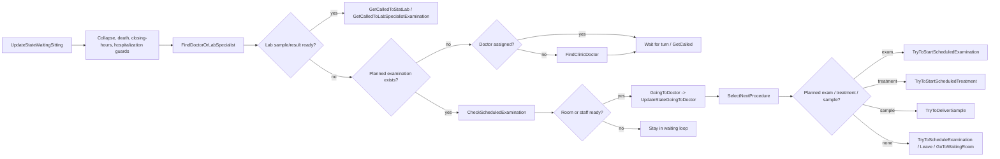
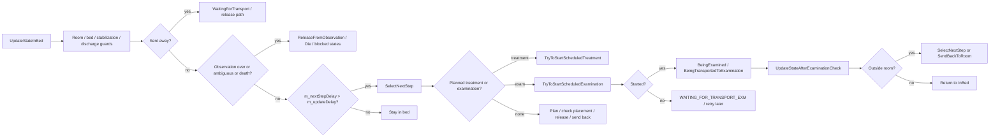

# Patient Flow And Hospitalization

Scope: vanilla `BehaviorPatient` and `HospitalizationComponent` flow, plus the current mod-side gates in `src/*.cs` that already cover parts of the path. Evidence comes from `docs/performance-investigation.md`, the decompiled `Assembly-CSharp.dll`, and the current mod sources.

## Outpatient flow

### What repeats

- `UpdateStateWaitingSitting` runs every patient tick while the patient is parked. It clears stale doctor linkage, checks collapse/death, checks closing hours, then re-enters the search path.
- `FindDoctorOrLabSpecialist` is the main outpatient scan hub. It re-checks lab sample delivery, stat-lab results, waiting-room validity, doctor validity, planned examinations, doctor assignment, and turn ownership.
- `CheckScheduledExamination` rebuilds a `ProcedureScene` query for the first planned exam, then can loop all departments to find a qualified fallback department.
- `UpdateStateGoingToDoctor` re-validates the walk target, patient control mode, doctor/lab ownership, and may redirect back to the waiting room.
- `SelectNextProcedure` is the arbitration point for diagnosis, scheduled exam start, sample delivery, treatment start, hospitalization gating, and final leave flow.
- `TryToScheduleExamination` is another heavy scan path because it starts from `SelectExaminationForMedicalCondition` and then validates availability for the selected exam.

### Safe throttles and backoff

| Target | Safe throttle/backoff | Why it is safe | Reset / invalidation |
|---|---:|---|---|
| `UpdateStateWaitingSitting` / `FindDoctorOrLabSpecialist` | 0.30s initial, 2.0s max | Vanilla already tolerates waiting-room delay; repeated scans do not need frame-level cadence when nothing is actionable. | `PATIENT_RESULTS_READY`, doctor/lab assignment, department change, patient collapse, sent home/away, waiting room invalid, planned exam/treatment added or removed. |
| `FindClinicDoctor` / doctor search | same as above | Search cost is pure lookup work until a doctor is assigned. | Same as above, plus clinician shift change and doctor free/busy state change. |
| `CheckScheduledExamination` reservation path | negative-cache only, short TTL | The expensive part is repeated failed availability checks, not successful starts. | Clear on reservation success, room free, staff free, plan mutation, or department change. |
| `SelectNextProcedure` arbitration miss | same outpatient backoff | The method is the dispatcher; if it returns false without state change, retrying immediately is waste. | Clear on any state transition, new plan, or a fresh scheduling board hit. |

### Invalidation events

- `PATIENT_RESULTS_READY` after a completed exam uncovers symptoms.
- `PATIENT_CHANGED_DEPARTMENT` after diagnosis or hospitalization reroutes the patient.
- `planned examination added`, `planned examination removed`, `planned treatment added`, `planned treatment removed`.
- `doctor became free`, `lab specialist became free`, `doctor shifted rooms`, `doctor reassigned`, `doctor fired`.
- `patient collapsed`, `patient died`, `patient sent home`, `patient sent away`.
- `waiting room no longer valid`, `patient turn advanced`, `chair / room / access right changed`.

## Inpatient flow

### What repeats

- `UpdateStateInBed` is the main inpatient loop. It checks room/bed integrity, stabilization, observation, ambiguity, collapse, night sleeping, meal/medicine windows, then periodically calls `SelectNextStep`.
- `SelectNextStep` is the inpatient dispatcher. It re-validates doctor assignment, doctor role, diagnosis, planned treatments, planned examinations, placement, preemptive planning, visitor logic, and send-back handling.
- `TryToStartScheduledExamination` does a two-phase pass over planned exams: reserved first, then unreserved, with `ReserveSceneForExamination` on each candidate.
- `UpdateStateAfterExaminationCheck` and `UpdateStateAfterTreatmentCheck` immediately return to `SelectNextStep` when the patient is still outside the room, which creates repeat pressure on the same routing and reservation logic.
- `ReleaseFromObservation`, `SendHome`, `StopMonitoring`, and `ClearBed` are the key release paths; they are also the right places to invalidate any cached inpatient decision.

### Safe throttles and backoff

| Target | Safe throttle/backoff | Why it is safe | Reset / invalidation |
|---|---:|---|---|
| `SelectNextStep` | 0.35s initial, 2.0s max | Vanilla already has `m_updateDelay` randomization around 0.5 to 0.9s in `UpdateStateInBed`; an adaptive miss-backoff fits that cadence. | Clear on any positive `SelectNextStep` result, state transition, new reservation, doctor/nurse free event, bed/room fix, discharge, transport completion. |
| `TryToStartScheduledExamination` | negative-cache only, short TTL | The costly part is repeated failed reservation/availability checks for the same planned exam. | Clear on reservation success, exam finished, room freed, staff freed, plan mutation, department change, transport started or completed. |
| `ReserveExamination` / `ReserveProcedure` | brokered failure cache | Cache only failures. Positive results should remain live only for the current tick. | Clear immediately on success; expire on TTL or any invalidation event. |
| `UpdateStateAfterExaminationCheck` / `UpdateStateAfterTreatmentCheck` | do not throttle the whole method | These methods also own state repair and transport/discharge handoff. Throttle only the nested `SelectNextStep` retry if needed. | Clear when `SendBackToRoom`, `WaitingForTransport`, or `InBed` is entered. |

### Invalidation events

- `procedure finished` or `procedure reservation released`.
- `room / bed / object freed`, `room broken`, `bed broken`, `room deleted`.
- `doctor became free`, `nurse became free`, `staff shift changed`, `staff fired`.
- `patient collapsed`, `patient died`, `patient sent away`, `patient sent home`.
- `department changed`, `transport completed`, `stretcher released`.
- `release/discharge` via `ReleaseFromObservation`, `SendHome`, `StopMonitoring`, `ClearBed`, `WaitingToBeReleased`.

## Repeated scan reuse

- The outpatient-side department board already exists in `SchedulingEngineService.TryGetPatientDepartmentBoard` and is already used by `ShouldSkipWaitingSitting` and `ShouldSkipPatientDoctorSearch` in `src/PerformanceOptimizations.cs`.
- The inpatient-side miss backoff already exists for `SelectNextStep` in `src/PerformanceOptimizations.cs`.
- The reservation broker already caches only failure results for `ReserveExamination` and `ReserveProcedure` in `src/PerformanceOptimizations.cs`.
- `EquipmentReferral.cs` already short-circuits two expensive outpatient paths: `TryToStartScheduledExamination` and `TryToScheduleExamination`.
- `ProductivityTweaks.cs` already adds the post-exam chained-hospitalization retry and the stale transport-reservation retry, which are the right places to invalidate cached inpatient decisions.

## Current source coverage

- `src/PerformanceOptimizations.cs`: outpatient backoff, inpatient backoff, reservation broker, board gating.
- `src/SchedulingEngine.cs`: patient department board, counters, and broker hit/miss/store accounting.
- `src/ProductivityTweaks.cs`: chained inpatient exam handling, stale transport reservation retry, nurse-check discharge.
- `src/EquipmentReferral.cs`: scheduled exam referral and scheduling-failure referral.

## Bottom line

The expensive parts are not the state-machine branches themselves. The cost comes from re-running the same patient lookup, exam availability, and reservation checks while the relevant world state is still unchanged. The safe optimization boundary is:

1. gate outpatient scans on the department board and a short adaptive backoff,
2. gate inpatient `SelectNextStep` on a short adaptive backoff,
3. cache only reservation failures, never positive reservation results,
4. clear everything immediately when the patient, plan, department, room, or staff state changes.
